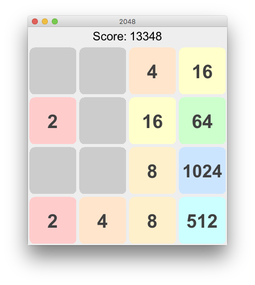
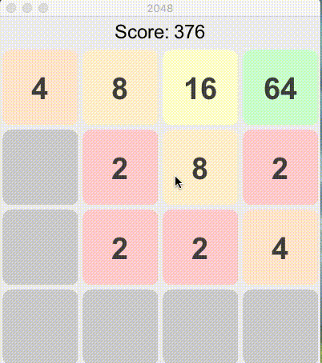
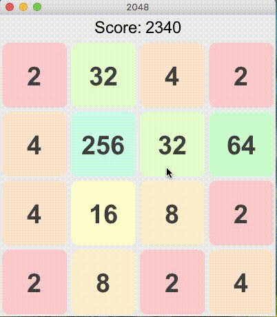

Game 2048
=========
Introduction:
-------------

This is the Java implementation of the popular game 2048.
It features game sound effects when running on Mac OS. The game tiles are buffered to make the tile movement smooth.
It also overrides the repaint method to reduce the flicker.

Reuqirements:
-------------
* Java - 1.8 and up
* Maven - 3.6.3 and up

Sounds:
-------
For Windows or Linux users, modify effect sound files defined in the the SoundPlayer.Type enum.

Screenshots:
------------

